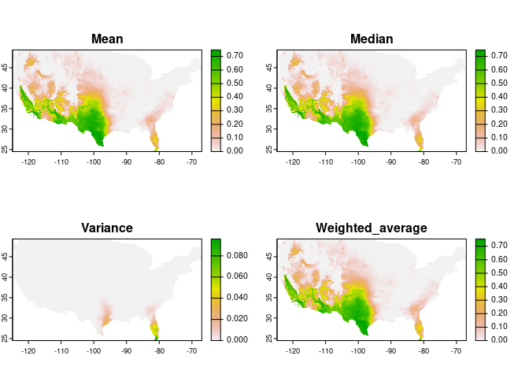
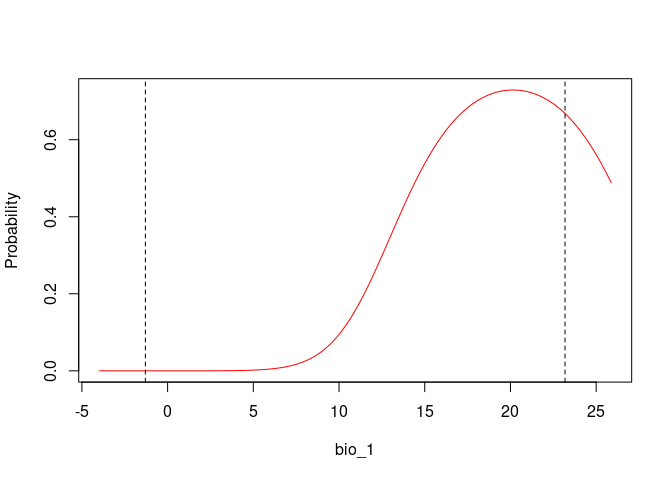
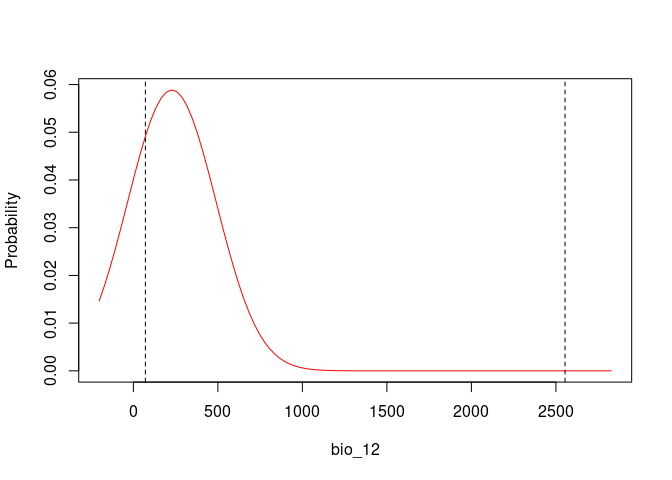

enmpa: Ecological Niche Modeling for Presence-absence Data
================
Luis F. Arias-Giraldo, Marlon E. Cobos, A. Townsend Peterson

- [Installation](#installation)
- [Example](#example)
  - [Loading packages needed](#loading-packages-needed)
  - [Example data](#example-data)
  - [Model formulas](#model-formulas)
  - [Model calibration and selection](#model-calibration-and-selection)
  - [Predictions (projections)](#predictions-projections)
  - [Consensus models](#consensus-models)
  - [Response Curves](#response-curves)
  - [Variable importance](#variable-importance)

<!-- README.md is generated from README.Rmd. Please edit that file -->
<!-- badges: start -->
<!-- badges: end -->
<hr>

The package `enmpa` comprises a set of tools to perform Ecological Niche
Modeling using presence-absence data. Some of the main functions help
perform data partitioning, model calibration, model selection, variable
response exploration, and model projection.

<br>

## Installation

You can install the development version of `enmpa` from
[GitHub](https://github.com/Luisagi/enmpa) with:

``` r
# install.packages("remotes")
remotes::install_github("Luisagi/enmpa")
```

<br>

## Example

### Loading packages needed

The package `terra` will be used to handle spatial data, and `enmpa`
will be used to perform ENM.

``` r
library(enmpa)
library(terra)
```

<br>

### Example data

This is a basic example which shows you how to solve a common problem:

``` r
# Load species occurrences and environmental data.
pa_data <- read.csv(system.file("extdata", "pa_data.csv", package = "enmpa"))
env_vars <- terra::rast(system.file("extdata", "raster_vars.tif", 
                                    package = "enmpa"))


# Presence-absence data with the values of environmental variables associated
head(pa_data)
#>   Pres_abs     bio_1 bio_12
#> 1        0  4.222687    403
#> 2        0  6.006802    738
#> 3        0  4.079385    786
#> 4        1  8.418489    453
#> 5        0  8.573750    553
#> 6        1 16.934618    319
```

Check raster layers for the projection area. Obtained from
[WorldClim](https://worldclim.org/):

- bio_1 = Annual Mean Temperature
- bio_12 = Annual Precipitation

``` r
terra::plot(env_vars, mar=  c(0, 0, 0, 5.1))
```


<br>

### Model formulas

With `enmpa` you have the possibility to explore multiple model formulas
derived from combinations of variables considering linear (l), quadratic
(q), and product (p) responses. Product refers to pair interactions of
variables.

Linear responses:

``` r
enmpa::get_formulas(dependent = "Pres_abs", 
                    independent = c("bio_1", "bio_12"), 
                    type = "l")
#> [1] "Pres_abs ~ bio_1"          "Pres_abs ~ bio_12"        
#> [3] "Pres_abs ~ bio_1 + bio_12"
```

Linear + quadratic responses:

``` r
enmpa::get_formulas(dependent = "Pres_abs", 
                    independent = c("bio_1", "bio_12"), 
                    type = "lq")
#>  [1] "Pres_abs ~ bio_1"                                    
#>  [2] "Pres_abs ~ bio_12"                                   
#>  [3] "Pres_abs ~ I(bio_1^2)"                               
#>  [4] "Pres_abs ~ I(bio_12^2)"                              
#>  [5] "Pres_abs ~ bio_1 + bio_12"                           
#>  [6] "Pres_abs ~ bio_1 + I(bio_1^2)"                       
#>  [7] "Pres_abs ~ bio_1 + I(bio_12^2)"                      
#>  [8] "Pres_abs ~ bio_12 + I(bio_1^2)"                      
#>  [9] "Pres_abs ~ bio_12 + I(bio_12^2)"                     
#> [10] "Pres_abs ~ I(bio_1^2) + I(bio_12^2)"                 
#> [11] "Pres_abs ~ bio_1 + bio_12 + I(bio_1^2)"              
#> [12] "Pres_abs ~ bio_1 + bio_12 + I(bio_12^2)"             
#> [13] "Pres_abs ~ bio_1 + I(bio_1^2) + I(bio_12^2)"         
#> [14] "Pres_abs ~ bio_12 + I(bio_1^2) + I(bio_12^2)"        
#> [15] "Pres_abs ~ bio_1 + bio_12 + I(bio_1^2) + I(bio_12^2)"
```

Linear + quadratic + products responses:

``` r
enmpa::get_formulas(dependent = "Pres_abs", 
                    independent = c("bio_1", "bio_12"), 
                    type = "lqp")
#>  [1] "Pres_abs ~ bio_1"                                                   
#>  [2] "Pres_abs ~ bio_12"                                                  
#>  [3] "Pres_abs ~ I(bio_1^2)"                                              
#>  [4] "Pres_abs ~ I(bio_12^2)"                                             
#>  [5] "Pres_abs ~ bio_1:bio_12"                                            
#>  [6] "Pres_abs ~ bio_1 + bio_12"                                          
#>  [7] "Pres_abs ~ bio_1 + I(bio_1^2)"                                      
#>  [8] "Pres_abs ~ bio_1 + I(bio_12^2)"                                     
#>  [9] "Pres_abs ~ bio_1 + bio_1:bio_12"                                    
#> [10] "Pres_abs ~ bio_12 + I(bio_1^2)"                                     
#> [11] "Pres_abs ~ bio_12 + I(bio_12^2)"                                    
#> [12] "Pres_abs ~ bio_12 + bio_1:bio_12"                                   
#> [13] "Pres_abs ~ I(bio_1^2) + I(bio_12^2)"                                
#> [14] "Pres_abs ~ I(bio_1^2) + bio_1:bio_12"                               
#> [15] "Pres_abs ~ I(bio_12^2) + bio_1:bio_12"                              
#> [16] "Pres_abs ~ bio_1 + bio_12 + I(bio_1^2)"                             
#> [17] "Pres_abs ~ bio_1 + bio_12 + I(bio_12^2)"                            
#> [18] "Pres_abs ~ bio_1 + bio_12 + bio_1:bio_12"                           
#> [19] "Pres_abs ~ bio_1 + I(bio_1^2) + I(bio_12^2)"                        
#> [20] "Pres_abs ~ bio_1 + I(bio_1^2) + bio_1:bio_12"                       
#> [21] "Pres_abs ~ bio_1 + I(bio_12^2) + bio_1:bio_12"                      
#> [22] "Pres_abs ~ bio_12 + I(bio_1^2) + I(bio_12^2)"                       
#> [23] "Pres_abs ~ bio_12 + I(bio_1^2) + bio_1:bio_12"                      
#> [24] "Pres_abs ~ bio_12 + I(bio_12^2) + bio_1:bio_12"                     
#> [25] "Pres_abs ~ I(bio_1^2) + I(bio_12^2) + bio_1:bio_12"                 
#> [26] "Pres_abs ~ bio_1 + bio_12 + I(bio_1^2) + I(bio_12^2)"               
#> [27] "Pres_abs ~ bio_1 + bio_12 + I(bio_1^2) + bio_1:bio_12"              
#> [28] "Pres_abs ~ bio_1 + bio_12 + I(bio_12^2) + bio_1:bio_12"             
#> [29] "Pres_abs ~ bio_1 + I(bio_1^2) + I(bio_12^2) + bio_1:bio_12"         
#> [30] "Pres_abs ~ bio_12 + I(bio_1^2) + I(bio_12^2) + bio_1:bio_12"        
#> [31] "Pres_abs ~ bio_1 + bio_12 + I(bio_1^2) + I(bio_12^2) + bio_1:bio_12"
```

<br>

### Model calibration and selection

The function `calibration_glm()` is a wrapper function that allows to:

- Create model formulas
- Fit and evaluate models based on such formulas
- Select best performing models

Model selection consists of three steps:

1.  a first filter to keep the models with ROC AUC \>= 0.5
    (statistically significant models).
2.  a second filter to maintain only models that meet a
    `selection_criterion` (“TSS”: TSS \>= 0.4; or “ESS”: maximum
    Accuracy - tolerance).
3.  from those, pick the ones with delta AIC \<= 2.

<br>

Results are returned as a list containing:

- selected models `*$selected`
- a summary of statistics for all models `*$summary`
- results obtained from cross-validation for all models
  `*$calibration_results`

<br>

Now lets run an example of model calibration and selection:

``` r
# Linear + quadratic + products responses
cal_res <- enmpa::calibration_glm(data = pa_data,
                                  dependent = "Pres_abs",
                                  independent = c("bio_1", "bio_12"),
                                  response_type = "lpq",
                                  selection_criterion = "TSS",
                                  cv_kfolds = 5,parallel = T, n_cores = 4)
#> 
#> Estimating formulas combinations for evaluation.
#> Evaluating a total of 31 models.
#> Running in Parallel using 4 threads.
#>   |                                                                              |                                                                      |   0%  |                                                                              |==                                                                    |   3%  |                                                                              |=====                                                                 |   7%  |                                                                              |=======                                                               |  10%  |                                                                              |=========                                                             |  13%  |                                                                              |============                                                          |  17%  |                                                                              |==============                                                        |  20%  |                                                                              |================                                                      |  23%  |                                                                              |===================                                                   |  27%  |                                                                              |=====================                                                 |  30%  |                                                                              |=======================                                               |  33%  |                                                                              |==========================                                            |  37%  |                                                                              |============================                                          |  40%  |                                                                              |==============================                                        |  43%  |                                                                              |=================================                                     |  47%  |                                                                              |===================================                                   |  50%  |                                                                              |=====================================                                 |  53%  |                                                                              |========================================                              |  57%  |                                                                              |==========================================                            |  60%  |                                                                              |============================================                          |  63%  |                                                                              |===============================================                       |  67%  |                                                                              |=================================================                     |  70%  |                                                                              |===================================================                   |  73%  |                                                                              |======================================================                |  77%  |                                                                              |========================================================              |  80%  |                                                                              |==========================================================            |  83%  |                                                                              |=============================================================         |  87%  |                                                                              |===============================================================       |  90%  |                                                                              |=================================================================     |  93%  |                                                                              |====================================================================  |  97%  |                                                                              |======================================================================| 100%
#> 
#> Running time: 3.36889982223511
#> 
#> Preparing results...
```

Process results:

``` r
# Two models were selected out of 31 models evaluated
cal_res$selected
#>                                                              Formulas
#> 1 Pres_abs ~ bio_1 + bio_12 + I(bio_1^2) + I(bio_12^2) + bio_1:bio_12
#> 2          Pres_abs ~ bio_1 + I(bio_1^2) + I(bio_12^2) + bio_1:bio_12
#>   Threshold_criteria Threshold_mean Threshold_sd ROC_AUC_mean ROC_AUC_sd
#> 1             maxTSS         0.0991       0.0154       0.9002     0.0192
#> 2             maxTSS         0.0951       0.0166       0.9003     0.0190
#>   False_positive_rate_mean False_positive_rate_sd Accuracy_mean Accuracy_sd
#> 1                   0.1720                 0.0216        0.8305      0.0198
#> 2                   0.1755                 0.0259        0.8274      0.0232
#>   Sensitivity_mean Sensitivity_sd Specificity_mean Specificity_sd TSS_mean
#> 1            0.856         0.0404           0.8280         0.0216   0.6840
#> 2            0.858         0.0363           0.8245         0.0259   0.6825
#>   TSS_sd Parameters     AIC Delta_AIC AIC_weight
#> 1 0.0450          5 2185.68    0.0000  0.6248182
#> 2 0.0404          4 2186.70    1.0201  0.3751818
```

<br>

### Predictions (projections)

After one or more models are selected, predictions can be made. In this
case we are projecting the model to the whole area of interest.

``` r
# Prediction for the two selected models
preds <- enmpa::predict_selected(x = cal_res, newdata = env_vars)

# Visualization
terra::plot(preds$predictions,  mar=  c(0, 0, 0, 5.1))
```


<br>

### Consensus models

An alternative to the strict selection of one single model is to use an
ensemble of models. The main idea is to avoid selecting the best model
and instead relying on multiple candidate models.

Here, we describe how to create agreement among these models using
techniques such as mean, median, or weighted averaging based on an
information criterion (Akaike weigths).

``` r
# Mean 
c_mean <- app(preds$predictions, mean)

# Median 
c_media <- terra::app(preds$predictions, median)

# Weighted average based on Akaike weights (wAIC)
wAIC <- cal_res$selected$AIC_weight
c_wmean <- terra::app(preds$predictions*wAIC, sum)

# Variance between the consensus methods
c_var <- terra::app(c(c_mean, c_media, c_wmean), var)


terra::plot(c(c_mean, c_media, c_wmean, c_var), 
            mar=  c(0, 0, 0, 5.1),
            main = c("Mean", "Median", "Weighted average (wAIC)", "Variance"))
```



<br>

### Response Curves

An important step in understanding the ecological niches that can be
characterized with these models is to explore variable responses. The
following lines of code help to do so:

``` r
# Response Curves for Bio_1 and Bio_2, first selected model 
par(mar = c(4, 4, .1, .1))

# BIO_1: 
enmpa::response_curve(model = preds$fitted_models$Model_ID_1,
                      variable = "bio_1",
                      new_data = env_vars)

# BIO_12:
enmpa::response_curve(model = preds$fitted_models$Model_ID_1,
                      variable = "bio_12",
                      new_data = env_vars)
```



<br>

### Variable importance

The variable importance or contribution to models can be calculated as a
function of the relative deviance explained by each predictor.

Model summary:

``` r
summary(preds$fitted_models$Model_ID_1)
#> 
#> Call:
#> glm(formula = as.formula(y), family = binomial(link = "logit"), 
#>     data = x$data, weights = x$weights)
#> 
#> Deviance Residuals: 
#>     Min       1Q   Median       3Q      Max  
#> -1.5537  -0.3876  -0.1032  -0.0140   3.4559  
#> 
#> Coefficients:
#>                Estimate Std. Error z value Pr(>|z|)    
#> (Intercept)  -8.032e+00  9.756e-01  -8.232  < 2e-16 ***
#> bio_1         9.336e-01  1.276e-01   7.318 2.52e-13 ***
#> bio_12       -3.322e-03  1.905e-03  -1.744   0.0811 .  
#> I(bio_1^2)   -3.076e-02  4.576e-03  -6.721 1.81e-11 ***
#> I(bio_12^2)  -6.626e-06  1.219e-06  -5.434 5.50e-08 ***
#> bio_1:bio_12  5.988e-04  1.178e-04   5.086 3.66e-07 ***
#> ---
#> Signif. codes:  0 '***' 0.001 '**' 0.01 '*' 0.05 '.' 0.1 ' ' 1
#> 
#> (Dispersion parameter for binomial family taken to be 1)
#> 
#>     Null deviance: 3374.9  on 5626  degrees of freedom
#> Residual deviance: 2173.7  on 5621  degrees of freedom
#> AIC: 2185.7
#> 
#> Number of Fisher Scoring iterations: 9
```

Analysis of Deviance for the first selected model:

``` r
anova(preds$fitted_models$Model_ID_1, test = "Chi")
#> Analysis of Deviance Table
#> 
#> Model: binomial, link: logit
#> 
#> Response: Pres_abs
#> 
#> Terms added sequentially (first to last)
#> 
#> 
#>              Df Deviance Resid. Df Resid. Dev  Pr(>Chi)    
#> NULL                          5626     3374.9              
#> bio_1         1   869.35      5625     2505.6 < 2.2e-16 ***
#> bio_12        1   177.56      5624     2328.0 < 2.2e-16 ***
#> I(bio_1^2)    1    78.29      5623     2249.7 < 2.2e-16 ***
#> I(bio_12^2)   1    47.40      5622     2202.3 5.774e-12 ***
#> bio_1:bio_12  1    28.63      5621     2173.7 8.775e-08 ***
#> ---
#> Signif. codes:  0 '***' 0.001 '**' 0.01 '*' 0.05 '.' 0.1 ' ' 1
```

Using a function from `enmpa` you can explore variable importance in
terms of contribution.

``` r
# Relative contribution of the deviance explained
varimport <- enmpa::var_importance(preds$fitted_models$Model_ID_1)
varimport
#>      predictor contribution cum_contribution
#> 1        bio_1   0.31901523        0.3190152
#> 3   I(bio_1^2)   0.28433044        0.6033457
#> 4  I(bio_12^2)   0.22805823        0.8314039
#> 5 bio_1:bio_12   0.15250677        0.9839107
#> 2       bio_12   0.01608933        1.0000000
```

Plotting these values can help with interpretations:

``` r
barplot(varimport$contribution, names = varimport$predictor)
```


