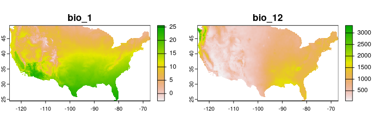
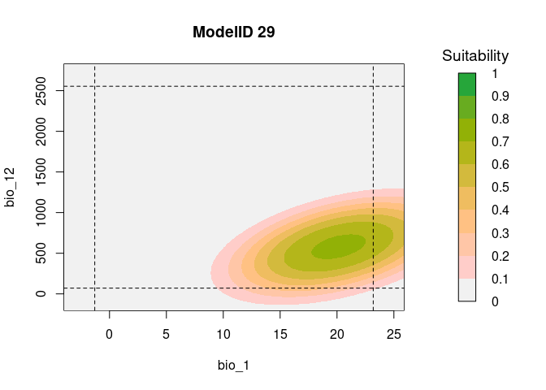
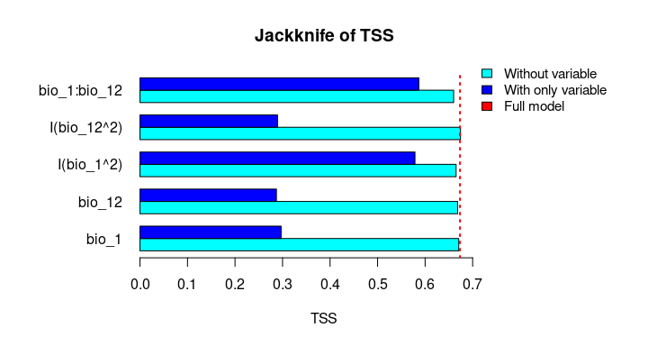
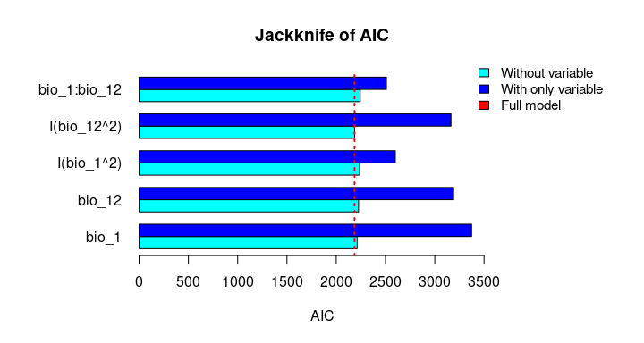
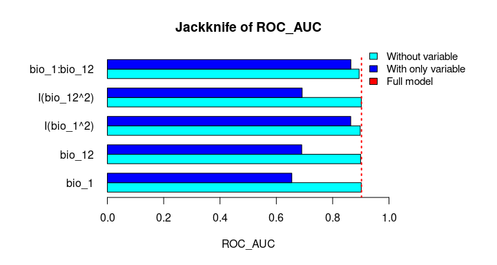
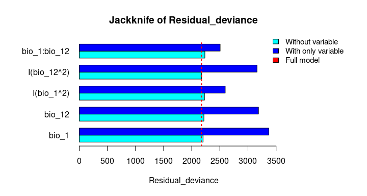

enmpa: Ecological Niche Modeling for Presence-absence Data
================
Luis F. Arias-Giraldo, Marlon E. Cobos, A. Townsend Peterson

- [Package description](#package-description)
- [Installation](#installation)
- [Packages required](#packages-required)
- [Example data](#example-data)
- [Example](#example)
  - [Detecting signals of ecological
    niche](#detecting-signals-of-ecological-niche)
  - [Model formulas](#model-formulas)
  - [Model calibration and selection](#model-calibration-and-selection)
  - [Fitting and predictions for selected
    models](#fitting-and-predictions-for-selected-models)
  - [Consensus models](#consensus-models)
  - [Response Curves](#response-curves)
  - [Two-way interactions](#two-way-interactions)
  - [Variable importance](#variable-importance)
  - [Model evaluation with independent
    data](#model-evaluation-with-independent-data)
  - [Literature](#literature)

<!-- README.md is generated from README.Rmd. Please edit that file -->
<!-- badges: start -->

[](https://github.com/Luisagi/enmpa/actions/workflows/R-CMD-check.yaml)

<!-- badges: end -->

</a>

<hr>

## Package description

`enmpa` is an r package that contains a set of tools to perform
Ecological Niche Modeling using presence-absence data. Some of the main
functions help perform data partitioning, model calibration, model
selection, variable response exploration, and model projection.

<br>

<hr>

## Installation

You can install the development version of `enmpa` from
[GitHub](https://github.com/Luisagi/enmpa) with:

<br>

## Packages required

The package `terra` is used to handle spatial data, and `enmpa` is used
to perform ENM.

``` r
library(enmpa)
library(terra)
```

<br>

## Example data

The data used in this example is included in `enmpa`.

``` r
# Species presence absence data associated with envrionmental variables
data("enm_data", package = "enmpa")

# Data for final model evaluation 
data("test", package = "enmpa")

# Environmental data as raster layers for projections
env_vars <- rast(system.file("extdata", "vars.tif", package = "enmpa"))

# Check the example data
head(enm_data)
#>   Sp     bio_1 bio_12
#> 1  0  4.222687    403
#> 2  0  6.006802    738
#> 3  0  4.079385    786
#> 4  1  8.418489    453
#> 5  0  8.573750    553
#> 6  1 16.934618    319
```

The raster layers for projections were obtained from
[WorldClim](https://worldclim.org/):

- bio_1 = Annual Mean Temperature
- bio_12 = Annual Precipitation

``` r
plot(env_vars, mar = c(1, 1, 2, 4))
```



<br>

## Example

### Detecting signals of ecological niche

To explore the relevance of the variables to be used in niche models, we
implemented in the methods developed by ([Cobos and Peterson
2022](#ref-cobos2022)). These methods help to identify signals of
ecological niche considering distinct variables and the presence-absence
data. By characterizing the sampling universe, this approach can
determine whether presences and absences can be separated better than
randomly considering distinct environmental factors.

``` r
sn_bio1  <- niche_signal(data = enm_data, variables = "bio_1", 
                         condition = "Sp", method = "univariate")

sn_bio12 <- niche_signal(data = enm_data, variables = "bio_12",
                         condition = "Sp", method = "univariate")
```

``` r
plot_niche_signal(sn_bio1, variables = "bio_1")
plot_niche_signal(sn_bio12, variables = "bio_12")
```


Based on the univariate test results, the variables bio_1 and bio_12
help to detect signals of ecological niche in our data. In our example,
the species tends to occur in areas with higher annual mean temperatures
(bio_1); whereas, considering annual precipitation (bio_12), the species
seems to be present in areas with lower values. See the function’s
documentation for more information.

<br>

### Model formulas

With `enmpa` you have the possibility to explore multiple model formulas
derived from combinations of variables considering linear (l), quadratic
(q), and product (p) responses. Product refers to pair interactions of
variables.

The function includes the flag `mode` to determine what strategy to use
to combine predictors based on the responses defined in . The options of
mode are:

- **light**.– returns simple iterations of complex formulas.
- **moderate**.– returns a comprehensive number of iterations.
- **intensive**.– returns all possible combination. Very time-consuming
  for 6 or more independent variables.
- **complex**.– returns only the most complex formula.

An example using linear + quadratic responses:

``` r
get_formulas(dependent = "Sp", independent = c("bio_1", "bio_12"),  
             type = "lq", mode = "intensive")
#>  [1] "Sp ~ bio_1"                                    
#>  [2] "Sp ~ bio_12"                                   
#>  [3] "Sp ~ I(bio_1^2)"                               
#>  [4] "Sp ~ I(bio_12^2)"                              
#>  [5] "Sp ~ bio_1 + bio_12"                           
#>  [6] "Sp ~ bio_1 + I(bio_1^2)"                       
#>  [7] "Sp ~ bio_1 + I(bio_12^2)"                      
#>  [8] "Sp ~ bio_12 + I(bio_1^2)"                      
#>  [9] "Sp ~ bio_12 + I(bio_12^2)"                     
#> [10] "Sp ~ I(bio_1^2) + I(bio_12^2)"                 
#> [11] "Sp ~ bio_1 + bio_12 + I(bio_1^2)"              
#> [12] "Sp ~ bio_1 + bio_12 + I(bio_12^2)"             
#> [13] "Sp ~ bio_1 + I(bio_1^2) + I(bio_12^2)"         
#> [14] "Sp ~ bio_12 + I(bio_1^2) + I(bio_12^2)"        
#> [15] "Sp ~ bio_1 + bio_12 + I(bio_1^2) + I(bio_12^2)"
```

<br>

### Model calibration and selection

The function `calibration_glm()` is a general function that allows to
perform the following steps:

- Partition data in k-folds
- Create formulas for candidate models
- Fit and evaluate candidate models
- Select best performing models

Model selection consists of three steps:

1.  A first filter to keep the models with ROC AUC \>= 0.5
    (statistically significant models).
2.  A second filter to maintain only models that meet a
    `selection_criterion` (“TSS”: TSS \>= 0.4; or “ESS”: maximum
    Accuracy - tolerance).
3.  From those, pick the ones with delta AIC \<= 2.

<br>

The results are returned as a list containing:

- Selected models (`*$selected`)
- A summary of statistics for all models (`*$summary`)
- Results obtained from cross-validation for all models
  (`*$calibration_results`)
- Input data used (`*$data`)
- The weights used (`*$weights`)
- The list of partition indices (`*$kfold_index_partition`)

<br>

Now lets run an example of model calibration and selection:

``` r
# Linear + quadratic + products responses
calibration <- calibration_glm(data = enm_data, dependent = "Sp",
                               independent = c("bio_1", "bio_12"),
                               response_type = "lpq",
                               formula_mode = "intensive", 
                               exclude_bimodal = TRUE, 
                               selection_criterion = "TSS",
                               cv_kfolds = 5, verbose = FALSE)
calibration
#> enmpa-class `enmpa_calibration`:
#> $selected             : Selected models (N = 2)
#> $summary              : A summary of statistics for all models. 
#> $calibration_results  : Results obtained from cross-validation for all models. 
#> $data                 : Data used for calibration. 
#> $partitioned_data     : k-fold indexes (k = 5)
#> $weights              : Use of weights (FALSE)
```

Process results:

``` r
## Summary of the calibrationm
summary(calibration)
#> 
#>                      Summary of enmpa_calibration                  
#> -------------------------------------------------------------------
#> 
#> Number of selected models: 2
#> Number of partitions: (k = 5)
#> Weights used: No
#> Summary of selected models (threshold criteria =  maxTSS ):
#>      ModelID ROC_AUC_mean Specificity_mean Sensitivity_mean TSS_mean AIC_weight
#> 1 ModelID_29       0.9003           0.8245            0.858   0.6825  0.3751818
#> 2 ModelID_31       0.9002           0.8280            0.856   0.6840  0.6248182
```

``` r
## Two models were selected out of 31 models evaluated
calibration$selected[, 1:2]  # Selected models
#>      ModelID                                                      Formulas
#> 1 ModelID_29          Sp ~ bio_1 + I(bio_1^2) + I(bio_12^2) + bio_1:bio_12
#> 2 ModelID_31 Sp ~ bio_1 + bio_12 + I(bio_1^2) + I(bio_12^2) + bio_1:bio_12
```

<br>

### Fitting and predictions for selected models

After one or more models are selected, the next steps are the fitting
and projection of these models. In this case we are projecting the
models to the whole area of interest.

``` r
# Fitting selected models
fits <- fit_selected(calibration)

# Prediction for the two selected models and their consensus
preds <- predict_selected(fits, newdata = env_vars, consensus = TRUE)

# Visualization
plot(preds$predictions, mar = c(1, 1, 2, 4))
```


<br>

### Consensus models

An alternative to strict selection of a single model is to use a
consensus model. The main idea is to avoid selecting the best model and
instead rely on multiple models with similar performance.

During the prediction of selected models, we calculated model consensus
using the mean, median, and a weighted average (using Akaike weights)
([Akaike 1973](#ref-akaike1973); [Wagenmakers and Farrell
2004](#ref-wagenmakers2004)).

``` r
# Consensus projections
plot(preds$consensus, mar = c(1, 1, 2, 5))
```


<br>

### Response Curves

An important step in understanding the ecological niches with these
models is to explore variable response curves. The following lines of
code help to do so:

``` r
# Response Curves for Bio_1 and Bio_2, first selected model 
response_curve(fitted = fits, modelID = "ModelID_29", variable = "bio_1")
response_curve(fitted = fits, modelID = "ModelID_29", variable = "bio_12")
```


``` r
# Consensus Response Curves for Bio_1 and Bio_2, for both models 
response_curve(fits, variable = "bio_1")
response_curve(fits, variable = "bio_12")
```


### Two-way interactions

It is useful to examine whether the effect of one variable depends on
the level of other variables. If it does, then we have what is called an
‘interaction’. According to the calibration results from this example,
in both models, the predictor `bio_1:bio_12` was selected. To explore
the interaction of these two variables, the function `resp2var` can help
us to visualize this interaction.

``` r
# Consensus Response Curves for Bio_1 and Bio_2, for both models 
resp2var(model = fits, 
         modelID = "ModelID_29",
         main = "ModelID 29",
         variable1 = "bio_1", 
         variable2 = "bio_12",
         extrapolate = TRUE, 
         add_limits = TRUE)

resp2var(model = fits, 
         modelID = "ModelID_31",
         main = "ModelID 31",
         variable1 = "bio_1", 
         variable2 = "bio_12",
         extrapolate = TRUE, 
         add_limits = TRUE)
```



<br>

### Variable importance

Variable importance or contribution to models can be calculated as a
function of the relative deviance explained by each predictor.

Analysis of Deviance for the first selected model:

``` r
anova(fits$glms_fitted$ModelID_29, test = "Chi")
#> Analysis of Deviance Table
#> 
#> Model: binomial, link: logit
#> 
#> Response: Sp
#> 
#> Terms added sequentially (first to last)
#> 
#> 
#>              Df Deviance Resid. Df Resid. Dev  Pr(>Chi)    
#> NULL                          5626     3374.9              
#> bio_1         1   869.35      5625     2505.6 < 2.2e-16 ***
#> I(bio_1^2)    1    46.77      5624     2458.8 7.972e-12 ***
#> I(bio_12^2)   1   239.69      5623     2219.1 < 2.2e-16 ***
#> bio_1:bio_12  1    42.40      5622     2176.7 7.450e-11 ***
#> ---
#> Signif. codes:  0 '***' 0.001 '**' 0.01 '*' 0.05 '.' 0.1 ' ' 1
```

Using a function from `enmpa` you can also explore variable importance
in terms of contribution.

``` r
# Relative contribution of the deviance explained for the first model
var_importance(fitted = fits, modelID = "ModelID_29")
#>      predictor contribution cum_contribution
#> 3  I(bio_12^2)    0.3572673        0.3572673
#> 1        bio_1    0.2919587        0.6492259
#> 2   I(bio_1^2)    0.2031750        0.8524009
#> 4 bio_1:bio_12    0.1475991        1.0000000
```

The function also allows to plot the contributions of the variables for
the two models together which can help with the interpretations:

``` r
# Relative contribution of the deviance explained
vi_both_models <- var_importance(fits)
```

``` r
# Plot
plot_importance(vi_both_models, extra_info = TRUE)
```


The Jackknife function providing a detailed reflection of the impact of
each variable on the overall model, considering four difference
measures: ROC-AUC, TSS, AICc, and Deviance.

``` r
# Jackknife test
jk <- jackknife(data = enm_data,
          dependent = "Sp",
          independent = c("bio_1", "bio_12"),
          response_type = "lpq")

jk
#> $Full_model_stats
#>     ROC_AUC       TSS     AIC Deviance
#> 1 0.9023279 0.6732916 2185.68  2173.68
#> 
#> $Formula
#> [1] "Sp ~ bio_1 + bio_12 + I(bio_1^2) + I(bio_12^2) + bio_1:bio_12"
#> 
#> $Without
#>                ROC_AUC       TSS      AIC Deviance
#> bio_1        0.9015319 0.6707435 2212.307 2202.307
#> bio_12       0.8991734 0.6684712 2226.488 2216.488
#> I(bio_1^2)   0.8978504 0.6651925 2237.051 2227.051
#> I(bio_12^2)  0.9016647 0.6744525 2186.700 2176.700
#> bio_1:bio_12 0.8938496 0.6600718 2243.562 2233.562
#> 
#> $With_only
#>                ROC_AUC       TSS      AIC Deviance
#> bio_1        0.6549700 0.2970911 3373.978 3369.978
#> bio_12       0.6902666 0.2871473 3191.205 3187.205
#> I(bio_1^2)   0.8641785 0.5786819 2599.638 2595.638
#> I(bio_12^2)  0.6916871 0.2894878 3164.568 3160.568
#> bio_1:bio_12 0.8646620 0.5868336 2509.565 2505.565
```

``` r
# Jackknife plots
plot_jk(jk, metric = "TSS")
plot_jk(jk, metric = "AIC")
plot_jk(jk, metric = "ROC_AUC")
plot_jk(jk, metric = "Deviance")
```



### Model evaluation with independent data

Finally, we will evaluate the final models using the “independent_eval”
functions. Ideally, the model should be evaluated with an independent
data set (i.e., data that was not used during model calibration or for
final model fitting).

#### Evaluation using presence-absence data.

Using independent data for which presence and absence is known can give
the most robust results. Here an example:

``` r
# In this example, we will use the final model calculated as the weighted 
# average of the two selected models.
wmean <- preds$consensus$Weighted_average

# check the test data
head(test, 10)
#>    Sp       lon      lat
#> 1   0 -105.6639 35.81247
#> 2   0 -107.9354 33.37200
#> 3   0 -100.3134 48.96018
#> 4   1 -117.5543 33.62975
#> 5   0 -120.6168 36.59670
#> 6   0 -105.3379 40.08928
#> 7   0 -115.4178 40.65446
#> 8   1 -100.9363 38.68424
#> 9   0 -119.2357 37.23158
#> 10  0 -118.8269 38.62374

# independent evaluation
eval <- independent_eval01(prediction = wmean,
                           observation = test$Sp, 
                           lon_lat = test[, c("lon", "lat")])

eval
#>     Threshold_criteria Threshold   ROC_AUC False_positive_rate Accuracy
#> 226                ESS 0.1500930 0.9570991          0.08988764     0.91
#> 192             maxTSS 0.1274123 0.9570991          0.10112360     0.91
#> 210              SEN90 0.1394197 0.9570991          0.10112360     0.90
#>     Sensitivity Specificity       TSS
#> 226   0.9090909   0.9101124 0.8192033
#> 192   1.0000000   0.8988764 0.8988764
#> 210   0.9090909   0.8988764 0.8079673
```

#### Evaluation using presence-only data.

When only presence data is available, the evaluation of performance is
based on the omission error and the partial ROC analysis.

To do this in our example, we will need to define a threshold value. We
can use any of the three threshold values obtained above: ESS, maxTSS or
SEN90.

``` r
# Threshold based in criteria: Sensitivity = 90%
th <- eval[3, "Threshold"]   

# Keep only presence records
test_p <- test[test$Sp == 1,]

# independent evaluation 
eval2 <- independent_eval1(prediction = wmean,
                           threshold = th, 
                           lon_lat = test[, c("lon", "lat")])

eval2
#>   omission_error threshold Mean_AUC_ratio pval_pROC
#> 1           0.81 0.1394197            NaN       NaN
```

### Literature

<div id="refs" class="references csl-bib-body hanging-indent"
entry-spacing="0">

<div id="ref-akaike1973" class="csl-entry">

Akaike, H. 1973. “Information Theory and an Extension of Maximum
Likelihood Principle.” In *Proc. 2nd Int. Symp. On Information Theory*,
267–81.

</div>

<div id="ref-cobos2022" class="csl-entry">

Cobos, Marlon E., and A. Townsend Peterson. 2022. “Detecting Signals of
Species’ Ecological Niches in Results of Studies with Defined Sampling
Protocols: Example Application to Pathogen Niches.” *Biodiversity
Informatics* 17 (May): 50–58. <https://doi.org/10.17161/bi.v17i.15985>.

</div>

<div id="ref-wagenmakers2004" class="csl-entry">

Wagenmakers, Eric-Jan, and Simon Farrell. 2004. “AIC Model Selection
Using Akaike Weights.” *Psychonomic Bulletin & Review* 11 (1): 192–96.
<https://doi.org/10.3758/BF03206482>.

</div>

</div>
