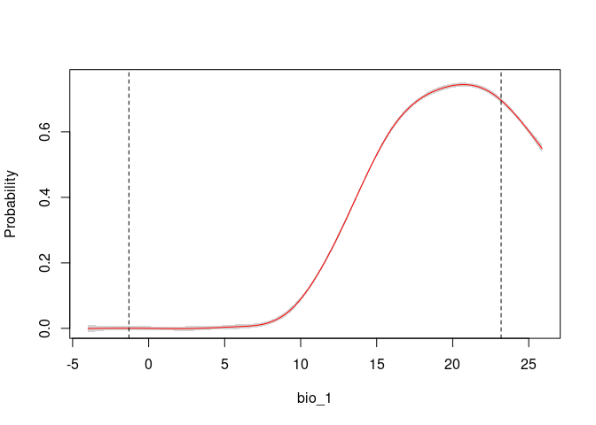
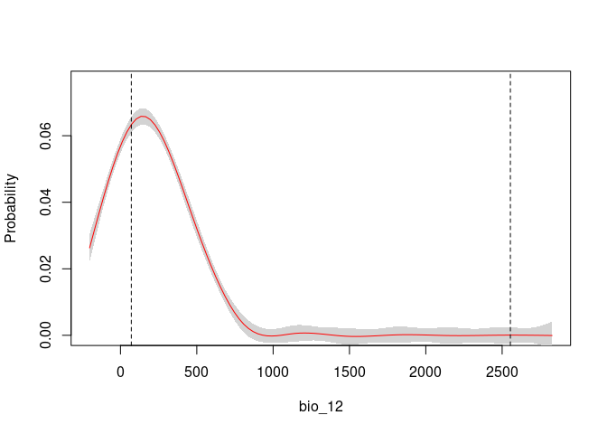
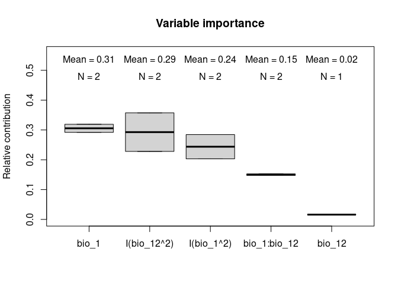

enmpa: Ecological Niche Modeling for Presence-absence Data
================
Luis F. Arias-Giraldo, Marlon E. Cobos, A. Townsend Peterson

- [Installation](#installation)
- [Example](#example)
  - [Loading packages needed](#loading-packages-needed)
  - [Example data](#example-data)
  - [Detecting niche signals](#detecting-niche-signals)
  - [Model formulas](#model-formulas)
  - [Model calibration and selection](#model-calibration-and-selection)
  - [Fitting and predictions of the most robust candidates
    models](#fitting-and-predictions-of-the-most-robust-candidates-models)
  - [Consensus models](#consensus-models)
  - [Response Curves](#response-curves)
  - [Variable importance](#variable-importance)
  - [Final model evaluation](#final-model-evaluation)
  - [Literature](#literature)

<!-- README.md is generated from README.Rmd. Please edit that file -->
<!-- badges: start -->
<!-- badges: end -->
<hr>

The package `enmpa` comprises a set of tools to perform Ecological Niche
Modeling using presence-absence data. Some of the main functions help
perform data partitioning, model calibration, model selection, variable
response exploration, and model projection.

<br>

## Installation

You can install the development version of `enmpa` from
[GitHub](https://github.com/Luisagi/enmpa) with:

``` r
# install.packages("remotes")
remotes::install_github("Luisagi/enmpa")
```

<br>

## Example

### Loading packages needed

The package `terra` will be used to handle spatial data, and `enmpa`
will be used to perform ENM.

``` r
library(enmpa)
library(terra)
```

<br>

### Example data

This is a basic example which shows you how to solve a common problem:

``` r
# Load species occurrences and environmental data.
pa_data  <- read.csv(system.file("extdata", "pa_data.csv", package = "enmpa"))
env_vars <- terra::rast(system.file("extdata", "vars.tif", package = "enmpa"))

# Presence-absence data with the values of environmental variables associated
head(pa_data)
#>   Sp     bio_1 bio_12
#> 1  0  4.222687    403
#> 2  0  6.006802    738
#> 3  0  4.079385    786
#> 4  1  8.418489    453
#> 5  0  8.573750    553
#> 6  1 16.934618    319
```

Check raster layers for the projection area. Obtained from
[WorldClim](https://worldclim.org/):

- bio_1 = Annual Mean Temperature
- bio_12 = Annual Precipitation

``` r
terra::plot(env_vars, mar = c(0, 0, 0, 5))
```


<br>

### Detecting niche signals

To assure the precision of the variables utilized in our niche models,
we implemented in this package the methodology developed by ([Cobos and
Peterson 2022](#ref-cobos2022)) that focuses on identifying niche
signals in presence-absence data. By characterizing the sampling
universe, this approach can determine whether pathogen detection is
random or linked to particular environmental factors.

``` r
sn_bio1  <- enmpa::niche_signal(data = pa_data, variables = "bio_1", 
                               condition = "Sp", method = "univariate")

sn_bio12 <- enmpa::niche_signal(data = pa_data, variables = "bio_12",
                                condition = "Sp", method = "univariate")
```

``` r

enmpa::plot_niche_signal(sn_bio1, variables = "bio_1")
enmpa::plot_niche_signal(sn_bio12, variables = "bio_12")
```


Based on the univariate test results of the variables bio_1 and bio_12,
there appears to be a distinct pattern or response to environmental
gradients that determines the presence of the species, rather than
random occurrences. For instance, in our example, the species tends to
occur in areas with higher annual mean temperature values (bio_1) as
evidenced by the observed value (blue vertical dotted line) falling
within the higher tail of the null distribution (H0). Conversely, the
observed values for annual precipitation (bio_12) were found in the
lower tail of the null distribution, indicating a preference for areas
with lower precipitation. Notably, the observed values were outside the
confidence limits of the null distribution in both cases. Therefore, it
can be concluded that both variables are useful in modeling the species’
niche. For more information, see ([Cobos and Peterson
2022](#ref-cobos2022)).

<br>

### Model formulas

With `enmpa` you have the possibility to explore multiple model formulas
derived from combinations of variables considering linear (l), quadratic
(q), and product (p) responses. Product refers to pair interactions of
variables.

The function includes the flag `mode` to determine what strategy to
iterate the predictors defined in for creating formulas:

- **light** - returns simple iterations of complex formulas.
- **moderate** - returns a comprehensive number of iterations.
- **intense** - returns all possible combination. Very time-consuming
  for 6 or more dependent variables.
- **complex** - returns only the most complex formula.

Linear + quadratic responses:

``` r
enmpa::get_formulas(dependent = "Sp", 
                    independent = c("bio_1", "bio_12"),  
                    type = "lq", mode = "intense")
#>  [1] "Sp ~ bio_1"                                    
#>  [2] "Sp ~ bio_12"                                   
#>  [3] "Sp ~ I(bio_1^2)"                               
#>  [4] "Sp ~ I(bio_12^2)"                              
#>  [5] "Sp ~ bio_1 + bio_12"                           
#>  [6] "Sp ~ bio_1 + I(bio_1^2)"                       
#>  [7] "Sp ~ bio_1 + I(bio_12^2)"                      
#>  [8] "Sp ~ bio_12 + I(bio_1^2)"                      
#>  [9] "Sp ~ bio_12 + I(bio_12^2)"                     
#> [10] "Sp ~ I(bio_1^2) + I(bio_12^2)"                 
#> [11] "Sp ~ bio_1 + bio_12 + I(bio_1^2)"              
#> [12] "Sp ~ bio_1 + bio_12 + I(bio_12^2)"             
#> [13] "Sp ~ bio_1 + I(bio_1^2) + I(bio_12^2)"         
#> [14] "Sp ~ bio_12 + I(bio_1^2) + I(bio_12^2)"        
#> [15] "Sp ~ bio_1 + bio_12 + I(bio_1^2) + I(bio_12^2)"
```

<br>

### Model calibration and selection

The function `calibration_glm()` is a wrapper function that allows to:

- Create model formulas
- Fit and evaluate models based on such formulas
- Select best performing models

Model selection consists of three steps:

1.  a first filter to keep the models with ROC AUC \>= 0.5
    (statistically significant models).
2.  a second filter to maintain only models that meet a
    `selection_criterion` (“TSS”: TSS \>= 0.4; or “ESS”: maximum
    Accuracy - tolerance).
3.  from those, pick the ones with delta AIC \<= 2.

<br>

Results are returned as a list containing:

- selected models `*$selected`
- a summary of statistics for all models `*$summary`
- results obtained from cross-validation for all models
  `*$calibration_results`
- input data with k-fold partition used `*$data`

<br>

Now lets run an example of model calibration and selection:

``` r
# Linear + quadratic + products responses
cal_res <- enmpa::calibration_glm(data = pa_data,
                                  dependent = "Sp",
                                  independent = c("bio_1", "bio_12"),
                                  response_type = "lpq", 
                                  form_mode = "intense", 
                                  exclude_bimodal = TRUE,
                                  selection_criterion = "TSS",
                                  cv_kfolds = 5, verbose = FALSE)
```

Process results:

``` r
## Two models were selected out of 31 models evaluated

cal_res$selected[,1]    # Selected models
#> [1] "Sp ~ bio_1 + I(bio_1^2) + I(bio_12^2) + bio_1:bio_12"         
#> [2] "Sp ~ bio_1 + bio_12 + I(bio_1^2) + I(bio_12^2) + bio_1:bio_12"

cal_res$selected[,2:20] # Metrics of evaluation
#>   Threshold_criteria Threshold_mean Threshold_sd ROC_AUC_mean ROC_AUC_sd
#> 1             maxTSS         0.0951       0.0166       0.9003     0.0190
#> 2             maxTSS         0.0991       0.0154       0.9002     0.0192
#>   False_positive_rate_mean False_positive_rate_sd Accuracy_mean Accuracy_sd
#> 1                   0.1755                 0.0259        0.8274      0.0232
#> 2                   0.1720                 0.0216        0.8305      0.0198
#>   Sensitivity_mean Sensitivity_sd Specificity_mean Specificity_sd TSS_mean
#> 1            0.858         0.0363           0.8245         0.0259   0.6825
#> 2            0.856         0.0404           0.8280         0.0216   0.6840
#>   TSS_sd Parameters     AIC Delta_AIC AIC_weight
#> 1 0.0404          4 2186.70    1.0201  0.3751818
#> 2 0.0450          5 2185.68    0.0000  0.6248182
```

<br>

### Fitting and predictions of the most robust candidates models

After one or more models are selected, the next steps are the fitting
and projection of the models. In this case we are projecting the model
to the whole area of interest.

``` r
# Extract model formulas and AIC weights. 
models <- cal_res$selected$Formulas
wIACs <- cal_res$selected$AIC_weight

# Fitting
f_models <- fit_glm(models, data = pa_data)

# Prediction for the two selected models and their consensus
preds <- enmpa::predict_selected(x = f_models, newdata = env_vars,
                                 consensus = T, consensus_weights = wIACs)

# Visualization
terra::plot(preds$predictions,  mar = c(0, 0, 0, 5))
```


<br>

### Consensus models

An alternative to strict selection of a single model is to use an
ensemble of models. The main idea is to avoid selecting the best model
and instead rely on multiple candidate models that prove to be robust.

Here we describe how to create concordance between these models using
techniques such as mean, median or weighted mean based on an information
criterion (Akaike weights)([Akaikei 1973](#ref-akaike1973); [Wagenmakers
and Farrell 2004](#ref-wagenmakers2004)).

``` r
# Consensus projections
terra::plot(preds$consensus, mar = c(0, 0, 0, 5.1))
```


<br>

### Response Curves

An important step in understanding the ecological niches that can be
characterized with these models is to explore variable responses. The
following lines of code help to do so:

``` r
# Response Curves for Bio_1 and Bio_2, first selected model 
enmpa::response_curve(model = f_models$Model_ID_1, variable = "bio_1",
                      new_data = env_vars)

enmpa::response_curve(model = f_models$Model_ID_1, variable = "bio_12",
                      new_data = env_vars)
```


``` r
# Consensus Response Curves for Bio_1 and Bio_2, from both models 
enmpa::response_curve(model = f_models, variable = "bio_1",
                      new_data = env_vars)

enmpa::response_curve(model = f_models, variable = "bio_12",
                      new_data = env_vars)
```



<br>

### Variable importance

The variable importance or contribution to models can be calculated as a
function of the relative deviance explained by each predictor.

Analysis of Deviance for the first selected model:

``` r
anova(f_models$Model_ID_1, test = "Chi")
#> Analysis of Deviance Table
#> 
#> Model: binomial, link: logit
#> 
#> Response: Sp
#> 
#> Terms added sequentially (first to last)
#> 
#> 
#>              Df Deviance Resid. Df Resid. Dev  Pr(>Chi)    
#> NULL                          5626     3374.9              
#> bio_1         1   869.35      5625     2505.6 < 2.2e-16 ***
#> I(bio_1^2)    1    46.77      5624     2458.8 7.972e-12 ***
#> I(bio_12^2)   1   239.69      5623     2219.1 < 2.2e-16 ***
#> bio_1:bio_12  1    42.40      5622     2176.7 7.450e-11 ***
#> ---
#> Signif. codes:  0 '***' 0.001 '**' 0.01 '*' 0.05 '.' 0.1 ' ' 1
```

Using a function from `enmpa` you can explore variable importance in
terms of contribution.

``` r
# Relative contribution of the deviance explained for the first model
enmpa::var_importance(f_models$Model_ID_1)
#>      predictor contribution cum_contribution
#> 3  I(bio_12^2)    0.3572673        0.3572673
#> 1        bio_1    0.2919587        0.6492259
#> 2   I(bio_1^2)    0.2031750        0.8524009
#> 4 bio_1:bio_12    0.1475991        1.0000000
```

The function also allows to plot the contributions of the variables for
the two models together which can help with the interpretations:

``` r
# Relative contribution of the deviance explained
(vi_both_models <- enmpa::var_importance(f_models))
#>      predictor contribution     Models
#> 1  I(bio_12^2)   0.35726725 Model_ID_1
#> 2        bio_1   0.29195868 Model_ID_1
#> 3   I(bio_1^2)   0.20317496 Model_ID_1
#> 4 bio_1:bio_12   0.14759911 Model_ID_1
#> 5        bio_1   0.31901523 Model_ID_2
#> 6   I(bio_1^2)   0.28433044 Model_ID_2
#> 7  I(bio_12^2)   0.22805823 Model_ID_2
#> 8 bio_1:bio_12   0.15250677 Model_ID_2
#> 9       bio_12   0.01608933 Model_ID_2
```

``` r
# Plot
enmpa::plot_importance(vi_both_models, extra_info = TRUE)
```



### Final model evaluation

Finally, we will evaluate the final models using the “independent_eval”
function. Ideally, the model should be validated with an independent
data set, but if unavailable, the entire initial data set used in the
calibration process can be used instead.

``` r
# Load species occurrences of an indepedent dataset
id_data  <- read.csv(system.file("extdata", "test_data.csv", package = "enmpa"))
head(id_data)
#>   Sp       lon      lat
#> 1  0 -105.6639 35.81247
#> 2  0 -107.9354 33.37200
#> 3  0 -100.3134 48.96018
#> 4  1 -117.5543 33.62975
#> 5  0 -120.6168 36.59670
#> 6  0 -105.3379 40.08928
```

##### Evaluation using presence-absence data.

``` r
# In this example, we will use the final model calculated as the weighted 
# average of the two selected models.
wmean <- preds$consensus$Weighted_average

eval <- independent_eval(data = id_data, prediction = wmean, occ = "Sp", 
                         crs = "EPSG:4326", xy = c("lon", "lat"))
#> The occurrence data contains both presences and absences.

eval
#>     Threshold_criteria Threshold   ROC_AUC False_positive_rate Accuracy
#> 226                ESS 0.1500930 0.9570991          0.08988764     0.91
#> 192             maxTSS 0.1274123 0.9570991          0.10112360     0.91
#> 210              SEN90 0.1394197 0.9570991          0.10112360     0.90
#>     Sensitivity Specificity       TSS
#> 226   0.9090909   0.9101124 0.8192033
#> 192   1.0000000   0.8988764 0.8988764
#> 210   0.9090909   0.8988764 0.8079673
```

##### Evaluation using presence-only data.

When only presence data is available, the evaluation metrics are based
on calculating the omission error and using a partial ROC analysis.

To do this we will have to define a threshold value, which will be the
minimum probability of a presence. We can use any of the three threshold
values obtained above: ESS, maxTSS or SEN90.

``` r
id_data_po <- id_data[id_data$Sp == 1, ] # presence-only data
th <- eval[, "Threshold"][3]             # Threshold based in criteria: SEN90

eval2 <- independent_eval(data = id_data_po, prediction = wmean, occ = "Sp",
                          threshold = th, crs = "EPSG:4326", 
                          xy = c("lon", "lat"))
#> The occurrence data contains only presences.

eval2
#>   omission_error threshold Mean_AUC_ratio_at_5 pval_pROC
#> 1     0.09090909 0.1394197            1.634595         0
```

### Literature

<div id="refs" class="references csl-bib-body hanging-indent">

<div id="ref-akaike1973" class="csl-entry">

Akaikei, H. 1973. “Information Theory and an Extension of Maximum
Likelihood Principle.” In *Proc. 2nd Int. Symp. On Information Theory*,
267–81.

</div>

<div id="ref-cobos2022" class="csl-entry">

Cobos, Marlon E., and A. Townsend Peterson. 2022. “Detecting Signals of
Species’ Ecological Niches in Results of Studies with Defined Sampling
Protocols: Example Application to Pathogen Niches.” *Biodiversity
Informatics* 17 (May): 50–58. <https://doi.org/10.17161/bi.v17i.15985>.

</div>

<div id="ref-wagenmakers2004" class="csl-entry">

Wagenmakers, Eric-Jan, and Simon Farrell. 2004. “AIC Model Selection
Using Akaike Weights.” *Psychonomic Bulletin & Review* 11 (1): 192–96.
<https://doi.org/10.3758/BF03206482>.

</div>

</div>
